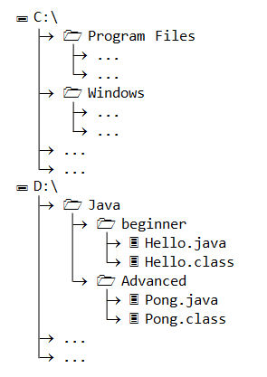

# 文件树结构的前端实现

## 起因
我之前在本科毕业面试一个游戏公司时收到一个面试题，就是去在前端实现Windows中的文件树结构，当时因为能力有限，不知道文件树的边界线怎么实现直接挂了，今天重做这个小项目来解决它

感谢海螺AI帮助我解决了这个问题，Kimi的解法根本不行



## 结果
还是通过CSS来实现,主要是通过伪元素中的`border-left`，
关键在于last-child的`border-left`要手动设置为`none`

```css
 .tree li:last-child:after {
            border-left: none;
        }
```